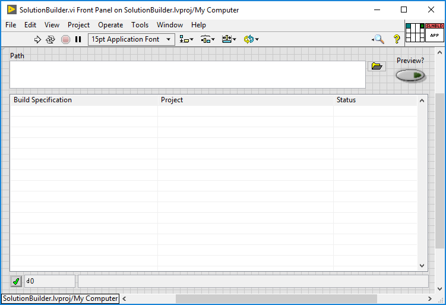

# Solution Builder for LabVIEW

Solution Builder is a tool for building LabVIEW project build specifications in the correct order and, when some of those build specifications generate *Packed Project Libraries* (PPL, which have a .lvlibp extension), replacement are made in memory to allow dependent components to relink to build output instead of the original source.

## Minimum Compatible LabVIEW Version

LabVIEW 2020 - Solution Builder uses a VI Server method introduced in LabVIEW 2020 to replace project items in memory.

## Use Case

### Common Source File Layout And Dependency Relationships

Source files are commonly organized by Component containing all related files and functionality. Dependencies for source files can span across components given that all the source is on disk when pulling a Git Repo.

#### Source Files on Disk

The following example shows the file structure of source files.

<table>
<tr><td style="text-align:center;font-weight:bold">Component A</td><td style="text-align:center;font-weight:bold">Component B</td></tr>
<tr><td>

```
MyAppRepo
└── obj/
└── releases/
└── src/Component A/
	└── myProjectA.lvproj
	└── CompA.lvlib
	└── myProgram.vi (CompA.lvlib:myProgram.vi)
```

</td><td>


```
MyAppRepo
└── obj/
└── releases/
└── src/Component B/
	└── myProjectB.lvproj
	└── CompB.lvlib
	└── myFunction.vi (CompB.lvlib:myFunction.vi)
```

</td></tr></table>

Where `CompA.lvlib:myProgram.vi` calls and depends on `CompB.lvlib:myFunction.vi`. Loading both of these source VIs from disks succeeds.

#### LabVIEW Project Structure

The following example shows the structure of the LabVIEW project files.

<table>
<tr><td style="text-align:center;font-weight:bold">myProjectA.lvproj</td><td style="text-align:center;font-weight:bold">myProjectB.lvproj</td></tr>
<tr><td>

```
└── My Computer
    └── CompA.lvlib
        └── myProgram.vi (CompA.lvlib:myProgram.vi)
    └── Dependencies
        └── CompB.lvlib
            └── myFunction.vi (CompB.lvlib:myFunction.vi)
    └── Build Specifications
        └── ComponentA (Packed Library)
```

</td><td>


```
└── My Computer
    └── CompB.lvlib
        └── myFunction.vi (CompB.lvlib:myFunction.vi)
    └── Dependencies
    └── Build Specifications
        └── ComponentB (Packed Library)
 
 
```

</td></tr>
</table>

Where the project Build Specifications have the additional Exclusions as follows:

- [ ] Disconnect type definitions
- [ ] Remove unused polymorphic VI instances
- [ ] Remove unused members of project libraries
- [x] __Exclude dependent packed libraries__
- [ ] Exclude dependent shared libraries

### Build Artifacts and Layout

Using the current LabVIEW Application Builder, the build results are not in the desired state because the build results are as follows:

<table>
<tr><td style="text-align:center;font-weight:bold">Component A</td><td style="text-align:center;font-weight:bold">Component B</td></tr>
<tr><td>

```
MyAppRepo
└── obj/
	└── CompA.lvlibp
		└── myProgram.vi (CompA.lvlibp:myProgram.vi)
		└── CompB.lvlib (CompA.lvlibp:CompB.lvlib)
			└── myFunction.vi (CompA.lvlibp:CompB.lvlib:myFunction.vi)
└── src/Component A/
```

</td><td>


```
MyAppRepo
└── obj/
	└── CompB.lvlibp
		└── myProgram.vi (CompB.lvlibp:myFunction.vi)
└── src/Component B/
 
 
```

</td></tr>
</table>

Where `Component B` is correctly built because it has not dependencies, but notice that `Component A` pulled in its own copy of its dependency where `CompA.lvlibp:myProgram.vi` calls and depends on `CompA.lvlibp:CompB.lvlib:myFunction.vi` which is not what we want. 

> Note: The exception exists when this is the desired state for shared helper code that, for isolution from revisional and breaking changes, we do want to pull in that namespaced copy.

Instead, for major components that are versioned like in our example, the desired state is that when `Component A` builds it switches its dependency to the built packed libary of `Component B` at build-time resulting in the following:

<table>
<tr><td style="text-align:center;font-weight:bold">Component A</td><td style="text-align:center;font-weight:bold">Component B</td></tr>
<tr><td>

```
MyAppRepo
└── obj/
	└── CompA.lvlibp
		└── myProgram.vi (CompA.lvlibp:myProgram.vi) -- depends on -->
└── src/Component A/
```

</td><td>


```
MyAppRepo
└── obj/
	└── CompB.lvlibp
		└── myFunction.vi (CompB.lvlibp:myFunction.vi)
└── src/Component B/
```

</td></tr>
</table>

Where `CompA.lvlibp:myProgram.vi` calls and depends on `CompB.lvlibp:myFunction.vi` looking similar to source namespacing and component boundaries.

### Cascading Packed Library Builds

To accomplish the correct build result the build needs to calculate the build order and then replace links to build results before building the next caller in the following fashion.

1. Analyze projects and their dependencies
1. Order the build specifications bottom-up
1. Build the first items with no dependencies
1. Find the next level that needs to build, whose dependencies have been built
1. Relink that next level to depend on the built components
1. Build that next level
1. Repeat the process from step 3 until there is nothing left to build.

### Multiple PPLs and Build Specification in a Single Project

The following example shows the structure of the LabVIEW project files and result when a single project contains multiple libraries that depend on each other and produce separate PPLs.

<table>
<tr><td style="text-align:center;font-weight:bold">myProjectA.lvproj (Source)</td><td style="text-align:center;font-weight:bold">Component A (Build Result)</td></tr>
<tr><td>

```
└── My Computer
    └── CompA.lvlib
        └── myProgram.vi (CompA.lvlib:myProgram.vi)
    └── subCompC.lvlib
        └── myFunctionC.vi (subCompC.lvlib:myFunctionC.vi)
    └── subCompD.lvlib
        └── myFunctionD.vi (subCompD.lvlib:myFunctionD.vi)
    └── Dependencies
        └── CompB.lvlib
            └── myFunction.vi (CompB.lvlib:myFunction.vi)
    └── Build Specifications
        └── ComponentA (Packed Library)
        └── subComponentC (Packed Library)
        └── subComponentD (Packed Library)
```

</td><td>


```
MyAppRepo
└── obj/
	└── CompA.lvlibp
		└── myProgram.vi (CompA.lvlibp:myProgram.vi)
	└── subCompC.lvlibp
		└── myFunctionC.vi (subCompC.lvlibp:myFunctionC.vi)
	└── subCompD.lvlibp
		└── myFunctionD.vi (subCompD.lvlibp:myFunctionD.vi)
└── src/Component A/
└── src/subComponent C/
└── src/subComponent D/


```

</td></tr>
</table>


## Usage

Solution Builder can be operated on through its user interface or by command-line.



* __Path__ : Path to the file or folder to execute on. The following are accepted:

<table>
<tr><td style="text-align:center;font-weight:bold">Example</td><td style="text-align:center;font-weight:bold">Explanation</td></tr>
<tr><td>C:\This\Folder</td><td>Folder containing .lvproj files (all files will be processed as one)</td></tr>
<tr><td>C:\This\Folder\Project.lvproj</td><td>A single .lvproj file (only this file will be processed)</td></tr>
<tr><td>C:\This\Folder\solution file.slnfile</td><td>A file (the extension is ignored) listing the projects to build and any associated pre-built PPLs needed to build the projects.)</td></tr>
</table>

* __Preview?__ : Will run the algorithm to determine the dependency build order, but will not execute the projects' build specification.

* __Results Table__ : Displays the found build specification outputs and show their build status.

* __Error/Warning Bar__ : Return any build errors or status from the utility.

When using a solution file, the following is an example valid content tags:
```
<Solution>
	<ProjectPath></ProjectPath>
	<AddPackedLib></AddPackedLib>
</Solution>
```

<table>
<tr><td style="text-align:center;font-weight:bold">Tag</td><td style="text-align:center;font-weight:bold">Explanation</td></tr>
<tr><td>Solution</td><td>Root node in the file</td></tr>
<tr><td>ProjectPath</td><td>Node that contains a path value used by solution builder to find build specifications. Multiple <i>ProjectPath</i> tags can be listed in a file. Valid path formats are as follows:

```
	<ProjectPath>C:\This\Is\A Windows Absolute Path.lvproj</ProjectPath>
	<ProjectPath>Relative\Path.lvproj</ProjectPath>
	<ProjectPath>..\Relative\Path.lvproj</ProjectPath>
	<ProjectPath>Relate Path/Forward Slash.lvproj</ProjectPath>
	<ProjectPath>../Relate Path/Forward Slash.lvproj</ProjectPath>
	<ProjectPath>/C/Linux/Absolute/Path.lvproj</ProjectPath>
```
</td></tr>
<tr><td>AddPackedLib</td><td>Node that contains a path value to a pre-built PPL to be used during the specified build. Multiple <i>AddPackedLib</i> tags can be listed in a file. Additionally and optionally, when a source Library is named differently than its PPL counterpart, the original name can be specified using the format "path_to_ppl.lvlibp::original_name". Valid formats are as follows and the path can be formated similar to ProjectPath paths:

```
	<AddPackedLib>Relative\Path.lvlibp</AddPackedLib>  # When the PPL and source names match
	<AddPackedLib>..\Relative\Path.lvlibp::OriginalName.lvlib</AddPackedLib>  # When the PPL and source names do not match
```
</td></tr>
</table>

### Invoking by Command-line

Invoking the packed tool from its LLB requires a command similar to the following:

```
Path_to_repo> "C:\program files\national instruments\LabVIEW 2020\LabVIEW.exe" <path_to_llb_obj>\SolutionBuilder.llb\SolutionBuilder.vi -- -Path path_to_some_project\myProject.lvproj -Quiet -AddPackedLib path_to_some_ppl\TheFile.lvlibp::TheOriginalLib.lvlib
```

The accepted command-line arguments are:

- -Path: Path to the folder, project, or solution file.
- -AddPackedLib: Path to a pre-built PPL (optional original source library name specified after "::"). Can specify multiple parameter/path pairs in one command.
- -Quiet: Auto close once build as completed (should not be used with -Preview)
- -Preview: Does not build but instead displays the list and build order of each build specification. Recommended for validation.

## How to Build

The owning LabVIEW project contains a build specification to create a self-contained LLB.

1. Open the project
1. Right-click the build specification

## How to Test

The owning LabVIEW project contains a *_test* folder containing a VI named `RunTheTests.vi`; Run that VI and verify that the results all pass.

## Contributions

This project welcomes Issues, Discussions, and Pull Requests.

1. Add new tests for the added functionality
1. Verify that all the tests pass
1. Verify that the build passes
1. Submit a PR and fill out the template fully.
